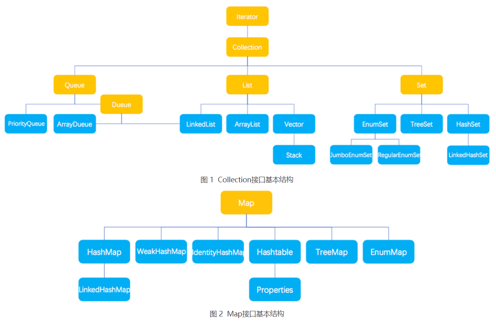

## 1 Java 集合详解

为了保存数量不确定的数据，以及保存具有映射关系的数据（也被称为关联数组），Java 提供了集合类。集合类主要负责保存、盛装其他数据，因此集合类也被称为容器类。ava 所有的集合类都位于 java.util 包下，提供了一个表示和操作对象集合的统一构架，包含大量集合接口，以及这些接口的实现类和操作它们的算法。
集合类和数组不一样，数组元素既可以是基本类型的值，也可以是对象（实际上保存的是对象的引用变量），而集合里只能保存对象（实际上只是保存对象的引用变量，但通常习惯上认为集合里保存的是对象）。
Java 集合类型分为 Collection 和 Map，它们是 Java 集合的根接口，这两个接口又包含了一些子接口或实现类。


在 图 1 和图 2 中，黄色块为集合的接口，蓝色块为集合的实现类。表 1 介绍了这些接口的作用。


对于 Set、List、Queue 和 Map 这 4 种集合，Java 最常用的实现类分别是 HashSet、TreeSet、ArrayList、ArrayDueue、LinkedList 和 HashMap、TreeMap 等。

表 2 Java集合实现类的作用
|类名称	|作用|
|---|---|
|HashSet	|为优化査询速度而设计的 Set。它是基于 HashMap 实现的，HashSet 底层使用 HashMap 来保存所有元素，实现比较简单|
|TreeSet	|实现了 Set 接口，是一个有序的 Set，这样就能从 Set 里面提取一个有序序列|
|ArrayList	|一个用数组实现的 List，能进行快速的随机访问，效率高而且实现了可变大小的数组|
|ArrayDueue	|是一个基于数组实现的双端队列，按“先进先出”的方式操作集合元素|
|LinkedList	|对顺序访问进行了优化，但随机访问的速度相对较慢。此外它还有 addFirst()、addLast()、getFirst()、getLast()、removeFirst() 和 removeLast() 等方法，能把它当成栈（Stack）或队列（Queue）来用|
|HsahMap	|按哈希算法来存取键对象|
|TreeMap	|可以对键对象进行排序|

## 2 Java Collection接口详解
Collection 接口是 List、Set 和 Queue 接口的父接口，通常情况下不被直接使用。Collection 接口定义了一些通用的方法，通过这些方法可以实现对集合的基本操作。定义的方法既可用于操作 Set 集合，也可用于操作 List 和 Queue 集合。

表 1 Collection接口的常用方法
|方法名称|	说明|
|---|---|
|boolean add(E e)	|向集合中添加一个元素，如果集合对象被添加操作改变了，则返回 true。E 是元素的数据类型|
|boolean addAll(Collection c)	|向集合中添加集合 c 中的所有元素，如果集合对象被添加操作改变了，则返回 true。|
|void clear()	|清除集合中的所有元素，将集合长度变为 0。|
|boolean contains(Object o)	|判断集合中是否存在指定元素|
|boolean containsAll(Collection c)|	判断集合中是否包含集合 c 中的所有元素|
|boolean isEmpty()	|判断集合是否为空|
|Iterator<E> iterator()|	返回一个 Iterator 对象，用于遍历集合中的元素|
|boolean remove(Object o)	|从集合中删除一个指定元素，当集合中包含了一个或多个元素 o 时，该方法只删除第一个符合条件的元素，该方法将返回 true。|
|boolean removeAll(Collection c)	|从集合中删除所有在集合 c 中出现的元素（相当于把调用该方法的集合减去集合 c）。如果该操作改变了调用该方法的集合，则该方法返回 true。|
|boolean retainAll(Collection c)|	从集合中删除集合 c 里不包含的元素（相当于把调用该方法的集合变成该集合和集合 c 的交集），如果该操作改变了调用该方法的集合，则该方法返回 true。|
|int size()	|返回集合中元素的个数|
|Object[] toArray()	|把集合转换为一个数组，所有的集合元素变成对应的数组元素。|

```java
public static void main(String[] args) {
    ArrayList list1 = new ArrayList(); // 创建集合 list1
    ArrayList list2 = new ArrayList(); // 创建集合 list2
    list1.add("one"); // 向 list1 添加一个元素
    list1.add("two"); // 向 list1 添加一个元素
    list2.addAll(list1); // 将 list1 的所有元素添加到 list2
    list2.add("three"); // 向 list2 添加一个元素
    System.out.println("list2 集合中的元素如下：");
    Iterator it1 = list2.iterator();
    while (it1.hasNext()) {
        System.out.print(it1.next() + "、");
    }
}
```

## 3 Java List集合
List 是一个有序、可重复的集合，集合中每个元素都有其对应的顺序索引。List 集合允许使用重复元素，可以通过索引来访问指定位置的集合元素。List 集合默认按元素的添加顺序设置元素的索引，第一个添加到 List 集合中的元素的索引为 0，第二个为 1，依此类推。

List 实现了 Collection 接口，它主要有两个常用的实现类：ArrayList 类和 LinkedList 类。
### ArrayList 类

ArrayList 类实现了可变数组的大小，存储在内的数据称为元素。它还提供了快速基于索引访问元素的方式，对**尾部成员**的增加和删除支持较好。使用 ArrayList 创建的集合，允许对集合中的元素进行快速的随机访问，不过，向 ArrayList 中插入与删除元素的速度相对较慢。

ArrayList 类的常用构造方法有如下两种重载形式：
ArrayList()：构造一个初始容量为 10 的空列表。
ArrayList(Collection<?extends E>c)：构造一个包含指定 Collection 元素的列表，这些元素是按照该 Collection 的迭代器返回它们的顺序排列的。

表 1 ArrayList类的常用方法
|方法名称	|说明|
|---|---|
|E get(int index)|	获取此集合中指定索引位置的元素，E 为集合中元素的数据类型|
|int index(Object o)	|返回此集合中第一次出现指定元素的索引，如果此集合不包含该元素，则返回 -1|
|int lastIndexOf(Object o)	|返回此集合中最后一次出现指定元素的索引，如果此集合不包含该元素，则返回 -1|
|E set(int index, Eelement)	|将此集合中指定索引位置的元素修改为 element 参数指定的对象。此方法返回此集合中指定索引位置的原元素|
|List<E> subList(int fromlndex, int tolndex)	|返回一个新的集合，新集合中包含 fromlndex 和 tolndex 索引之间的所有元素。包含 fromlndex 处的元素，不包含 tolndex 索引处的元素|
注意：当调用 List 的 set(int index, Object element) 方法来改变 List 集合指定索引处的元素时，指定的索引必须是 List 集合的有效索引。例如集合长度为 4，就不能指定替换索引为 4 处的元素，也就是说这个方法不会改变 List 集合的长度。

```java
// ArrayList初始化 四种初始化的形式
// Arrays.asList
ArrayList<String> obj = new ArrayList<String>(Arrays.asList("aaa", "bbb"))
// 生成匿名内部内进行初始化
ArrayList<String> obj = new ArrayList<String>() {{
    add("aaa");
    add("ccc");
}};
// 常规方式
ArrayList<T> obj = new ArrayList<T>();
obj.add("o1");
obj.add("o2");
// 使用Collections.ncopies(通过复制)
String element = "hello";
ArrayList<String> obj = new ArrayList<String>(Collections.nCopies(count, element));

// 使用 subList() 方法截取 List 集合中部分元素时要注意，新的集合中包含起始索引位置的元素，但是不包含结束索引位置的元素。例如，subList(1,4) 方法实际截取的是索引 1 到索引 3 的元素，并组成新的 List 集合。

// ArrayList 删除元素
// remove() 方法用于删除动态数组里的单个元素。
// 删除指定元素
arraylist.remove(Object obj)
// 删除指定索引位置的元素
arraylist.remove(int index)
// 如果传入元素，删除成功，则返回 true。
// 如果传入索引值，则返回删除的元素。
```

### LinkedList 类

https://blog.csdn.net/Neo233/article/details/80501110
LinkedList 类采用链表结构保存对象，这种结构的优点是便于向集合中插入或者删除元素。需要频繁向集合中插入和删除元素时，使用 LinkedList 类比 ArrayList 类效果高，但是 LinkedList 类随机访问元素的速度则相对较慢。这里的随机访问是指检索集合中特定索引位置的元素。

LinkedList 类除了包含 Collection 接口和 List 接口中的所有方法之外，还特别提供了表 2 所示的方法。
表 2 LinkList类中的方法
|方法名称|	说明|
|---|---|
|void addFirst(E e)	|将指定元素添加到此集合的开头|
|void addLast(E e)|	将指定元素添加到此集合的末尾|
|E getFirst()|	返回此集合的第一个元素|
|E getLast()	|返回此集合的最后一个元素|
|E removeFirst()|	删除此集合中的第一个元素|
|E removeLast()	|删除此集合中的最后一个元素|


### ArrayList 类和 LinkedList 类的区别
ArrayList 与 LinkedList 都是 List 接口的实现类，因此都实现了 List 的所有未实现的方法，只是实现的方式有所不同。

ArrayList 是基于动态数组数据结构的实现，访问元素速度优于 LinkedList。LinkedList 是基于链表数据结构的实现，占用的内存空间比较大，但在批量插入或删除数据时优于 ArrayList。

对于快速访问对象的需求，使用 ArrayList 实现执行效率上会比较好。需要频繁向集合中插入和删除元素时，使用 LinkedList 类比 ArrayList 类效果高。

不同的结构对应于不同的算法，有的考虑节省占用空间，有的考虑提高运行效率，对于程序员而言，它们就像是“熊掌”和“鱼肉”，不可兼得。高运行速度往往是以牺牲空间为代价的，而节省占用空间往往是以牺牲运行速度为代价的。


## 4 Java Set集合
Set 集合通常不能记住元素的添加顺序。也就是说 Set 集合中的对象不按特定的方式排序，只是简单地把对象加入集合。Set 集合中不能包含重复的对象，并且最多只允许包含一个 null 元素。

Set 实现了 Collection 接口，它主要有两个常用的实现类：HashSet 类和 TreeSet类。
### HashSet 类
HashSet 是 Set 接口的典型实现，大多数时候使用 Set 集合时就是使用这个实现类。HashSet 是按照 Hash 算法来存储集合中的元素。因此具有很好的存取和查找性能。
HashSet 具有以下特点：
+ 不能保证元素的排列顺序，顺序可能与添加顺序不同，顺序也有可能发生变化。
+ HashSet 不是同步的，如果多个线程同时访问或修改一个 HashSet，则必须通过代码来保证其同步。
+ 集合元素值可以是 null。


### TreeSet 类
TreeSet 类同时实现了 Set 接口和 SortedSet 接口。SortedSet 接口是 Set 接口的子接口，可以实现对集合进行自然排序，因此使用 TreeSet 类实现的 Set 接口默认情况下是自然排序的，这里的自然排序指的是升序排序。

TreeSet 只能对实现了 Comparable 接口的类对象进行排序

TreeSet 类除了实现 Collection 接口的所有方法之外，还提供了如表 2 所示的方法。
表 2 TreeSet类的常用方法
|方法名称	|说明|
|---|---|
|E first()|	返回此集合中的第一个元素。其中，E 表示集合中元素的数据类型|
|E last()|	返回此集合中的最后一个元素|
|E poolFirst()	|获取并移除此集合中的第一个元素|
|E poolLast()	|获取并移除此集合中的最后一个元素|
|SortedSet<E> subSet(E fromElement,E toElement)	|返回一个新的集合，新集合包含原集合中 fromElement 对象与 toElement 对象之间的所有对象。包含 fromElement 对象，不包含 toElement 对象|
|SortedSet<E> headSet<E toElement〉	|返回一个新的集合，新集合包含原集合中 toElement 对象之前的所有对象。不包含 toElement 对象|
|SortedSet<E> tailSet(E fromElement)	|返回一个新的集合，新集合包含原集合中 fromElement 对象之后的所有对象。包含 fromElement 对象|
注意：表面上看起来这些方法很多，其实很简单。因为 TreeSet 中的元素是有序的，所以增加了访问第一个、前一个、后一个、最后一个元素的方法，并提供了 3 个从 TreeSet 中截取子 TreeSet 的方法。


## Queue

### PriorityQueue


```java
```


